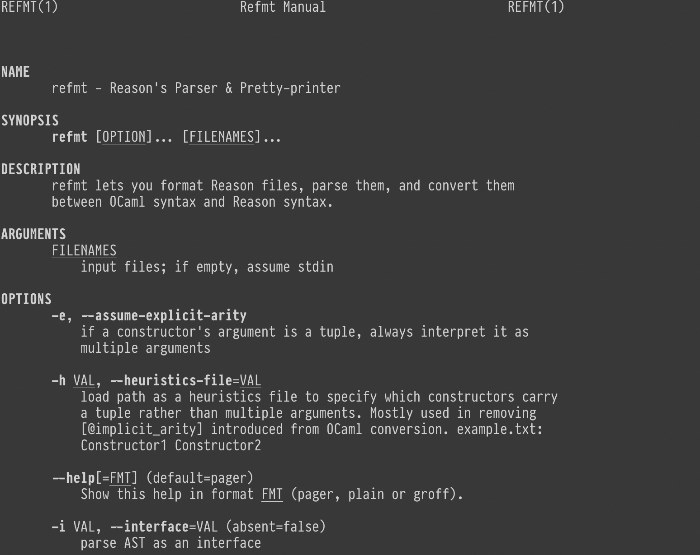
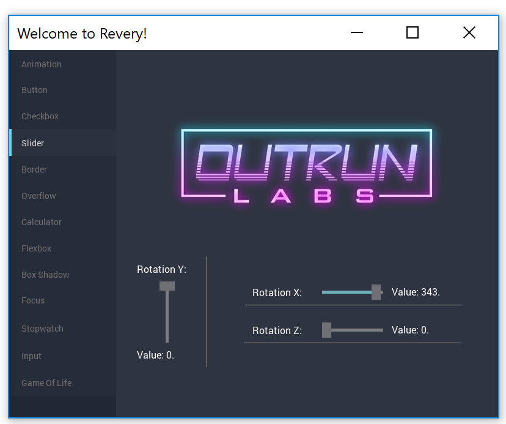

# Reason Project Ideas

> **Collection of project ideas for Reason which have been requested by
people in the community.**

Links to active efforts are included in this README. It's great to
collaborate with people already working on some of these ideas, or
start your own thing. Send a PR to list your effort
under the "Active Efforts:" section, so people know how to team up.

Please discuss new project ideas on [The Reason Discord
Channel](https://discordapp.com/invite/reasonml).

## High Level Web Server/Client APIs

Simple APIs for doing web related requests/servers.
- Creating / proposing common APIs that various implementations can
  implement (even without implementation).
- Creating basic implementations of web servers/clients.

**Active Efforts:**
- [morph](https://github.com/reason-native-web/morph) simple web
  server/client APIs.
- [h2](https://github.com/anmonteiro/ocaml-h2) a full `HTTP/2`
  implementation in OCaml.
  
  
## Cross-plat Universal Typeahead in Reason and Revery:

- For reference: [Rofi](https://github.com/davatorium/rofi) is like a
 supercharged `dmenu` replacement that exists, and is written in C++
 (screenshot below).
- One option is to port Rofi to a cross platform native app using
  [Revery](https://github.com/revery-ui/revery). Line for line ports
  are a great way to avoid bikeshedding and quickly get something out there.
- Instead of porting it line for line, you could also reimagine
  the same concept from the ground up.

Example of Rofi Linux Package:


## Quality Bindings To libcurl

For when someone isn't interested in using some of the newer HTTP
libraries in OCaml.

**Active Efforts:**
- [`ocurl`](https://github.com/ygrek/ocurl)


## Reason On Rails

Rails-like scaffolding generator for certain kinds of apps. To avoid
bikeshedding, you might even consider using the exact rails workflow.

## Lightweight Universal Date/Time Library

A lightweight date/time library that doesn't rely on system dependencies,
and can configure all date conversions from config files. (Either at build
time or runtime?)
- Time (just the number of milliseconds since epoch).
- TimeRange (two Time points).
- DateTime (Human description of DateTime).
- DateTimeZone (Human description of DateTime within a time zone).
- Converting between all of these forms (based on some time zone data base config files).

Date/Time experts, please contribute by pointing to excellent libraries
and provide advice.

Approaches:
- Could just port line for line, one of the best date-time libraries out there.

## Java Backend

The [`rehp`](https://github.com/jordwalke/rehp) project makes it
easier to implement new backends for Reason/OCaml when compiling in
the native workflow.

It can pretty easily be extended for other languages, and `rehp`
includes an example of extending it for PHP(Hack flavor).


## Automatic Command Line App Generator:

- `devDependency` you can add to your native Reason project.
- Run `generate-cli-app ./path/to/Main.re` where `Main.re` contains:

```reason
let main = (
    /**
      * Doc for `thisArg` shown in the command line.
      */
    ~thisArg="default",
    /**
      * Doc for `mandatoryArgBecausNoDefault`.
      */
    ~mandatoryArgBecauseNoDefault
    /**
      * Doc for mandatory `positionalArgWithoutName`.
      */
    positionalArgWithoutName
  ) => {
  /**
   * Your implementation goes here.
   */
};

/**
 * <GENERATE_CLI_APP>
 */
```

And then it will replace the footer comment with the argument
parsing, and help documentation code that allows you to run the
generated binary as a command line app. For example once built, you
could run:

```bash
MainCli.exe --help
```
which would provide output identical to
[cmdliner](https://github.com/dbuenzli/cmdliner)'s help output. For
an example, see `refmt --help`:



It could also generate man pages in your project's releases based on this.

**Implementation:**
- `@reason-native/pastel` is a good option for terminal highlighting.
- The simplest implementation could just parse the AST and would
  require that each named argument include a type annotation and
  would only support `int`, `string`, `floats` etc.
- Another feature would be to support an "enum" (variant) defined in
  the same file to represent the different string options.
- A more advanced version might support using an approach like
  [`milk`](https://github.com/jaredly/milk) to infer the types.
  (Would require a bit of support from Milk to be usable for other
  purposes - so this would only make sense after `milk` is extended
  to support other use cases).

**Related Effort:**
- [ppx_deriving_cmdliner](https://github.com/hammerlab/ppx_deriving_cmdliner)
  (doesn't use named arguments to generate command line API, but
  would be a good reference).

## One Click Native Project Creation/Updating

**Active Efforts:**
- [`pesy`](https://github.com/esy/pesy): Project by [Manas](https://github.com/prometheansacrifice) to make new native projects in a single command. Bonus: It will keep your project/build config up to date based on your config in `package.json` by running `esy pesy` from your project root. Makes use of great automatically created cross platform CI.


## Full Native React:
**Active Efforts:**
- [Revery](https://github.com/revery-ui/revery) an Electron-style cross platform desktop app framework with full native React-style UI implementation based on [Brisk Reconciler](https://github.com/briskml/brisk-reconciler).

- [Revery Packager](https://github.com/revery-ui/revery-packager) One click packaging up of Revery UI applications into installable desktop apps.


## Reason Browser Console Formatter:
Print more readable structures in the browser for debugging purposes.

**Active Efforts:**
[reason-console-formatter](https://github.com/davesnx/reason-console-formatter)
